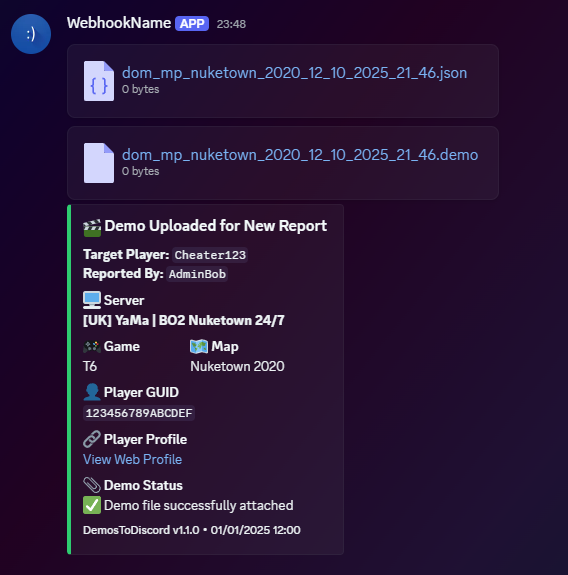
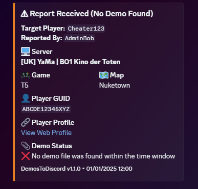

[](https://github.com/OllyMc27/DemosToDiscord/releases)

# DemosToDiscord

Automatically uploads Plutonium demo files to Discord when a player is reported in IW4MAdmin.

This plugin is intended to work **alongside existing IW4MAdmin → Discord bridge plugins**, such as:

- [**BetterIW4ToDiscord**](https://github.com/Ayymoss/BetterIW4ToDiscord)
- [**YADB – Yet Another Discord Bridge**](https://forum.awog.at/topic/89/release-yadb-yet-another-discord-bridge)

Those plugins handle chat, reports, and general events.  
**DemosToDiscord focuses purely on attaching the actual demo files** to Discord when a report happens.

The goal is to remove the manual work for staff — no hunting through demo folders, no guessing which file is correct.

---

## ✅ Features

- Supports **T5 (Black Ops 1)** and **T6 (Black Ops 2)**
- Automatically locates the correct demo based on:
  - Report time
  - Map name
  - Game mode
- Handles busy servers and overlapping matches correctly
- Waits for the match to finish and the demo file to unlock before uploading
- Uploads:
  - `.demo` files
  - Optional T6 `.json` metadata files when available
- Simple drop-in installation

---

## 📸 Example Discord Messages

Below are real examples of what the plugin posts into Discord.

---

### ✅ Demo Successfully Uploaded

> When a matching demo file is found, it is automatically uploaded with full context for staff to review.



Includes:
- Server and game
- Map at report-time
- Reporter and reported player
- Player GUID
- Web profile link
- Attached demo file(s)
- Plugin version and timestamp

---

### ⚠ No Demo Found

> If no demo is found within the configured window, the report is still posted so staff are aware.



Includes:
- Full report context
- Clear “No demo found” status
- Same layout and formatting for consistency

---

## 🛠 Installation

1. Download the DLL from the **Releases** page
2. Copy it to: `<IW4MAdmin Root>/IW4MAdmin/Plugins/`
3. Restart IW4MAdmin
4. Edit `DemosToDiscord.json`
5. Add your Discord webhook and demo paths
6. Restart IW4MAdmin again

---

## ⚙ Configuration

Example `DemosToDiscord.json`:

```json
{
"Webhook": "https://discord.com/api/webhooks/...",
"T5DemoPath": "C:\\Users\\Administrator\\AppData\\Local\\Plutonium\\storage\\t5\\demos",
"T6DemoPath": "C:\\Users\\Administrator\\AppData\\Local\\Plutonium\\storage\\t6\\demos",

"MaxLookbackMinutes": 90,
"MaxWaitMinutes": 30,
"RetryIntervalSeconds": 20,
"PostMatchDelaySeconds": 10,

"Debug": false,
"RenameOnUpload": true
}
 
