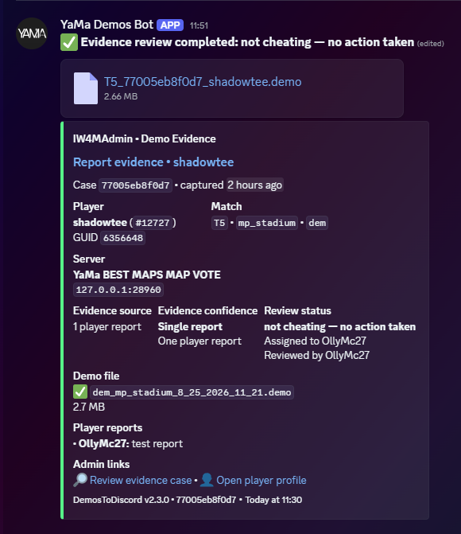

# DemosToDiscord

[](https://github.com/OllyMc27/DemosToDiscord/releases)
[](https://github.com/OllyMc27/DemosToDiscord/actions)
[](LICENSE)

An [IW4MAdmin](https://github.com/RaidMax/IW4M-Admin) plugin that turns player reports and automated anti-cheat bans into organised evidence cases with Discord demo delivery and a webfront review workflow.

[Read the full Wiki](https://github.com/OllyMc27/DemosToDiscord/wiki) for installation, configuration, evidence matching and troubleshooting.



## Features

### Evidence collection

- Uploads T5 and T6 `.demo` files directly to Discord, without ZIP archives or filename changes, so downloads remain compatible with Plutonium theatre.
- Captures T6 automated anti-cheat bans even when nobody reports the player.
- Groups reports, automated detections and observed manual bans from the same match into one case; manual bans never create a separate cross-server case.
- Uses T6 JSON metadata to confirm the target GUID when available.
- Keeps T4, IW5 and T5 Zombies reports as metadata-only cases where demo recording is unavailable.
- Uses a background queue with deduplication, retries and stable-file checks.

### Webfront review

- Adds a permission-protected **Admin → Demo Evidence** dashboard and detailed case page.
- Supports player/case search and filters for game, server, source, demo state, review state and date.
- Includes unassigned and assigned-to-me queues for shared admin teams.
- Shows match details, reports, demo downloads, game statistics, anti-cheat metrics and event snapshots.
- Adds a player timeline with join, report, anti-cheat and leave times plus their positions within the demo.
- Adds evidence confidence, case activity history and previous retained cases for the same player.
- Reuses IW4MAdmin's native profile, statistics, Ban, Kick, Flag and Add Note actions.
- Records review outcomes, reviewer notes and case-scoped report clearing.

### Discord integration

- Sends compact evidence embeds with direct links to the case and player profile.
- Keeps Discord attachments downloadable through fresh CDN links in the webfront.
- Updates the original Discord message when a case is assigned or reviewed.
- Uses a configurable timezone in the `HH:mm:ss dd/MM/yyyy` format throughout the webfront and Discord, defaulting to `Europe/London`.
- Supports default, per-game and per-server webhooks plus optional restricted role notifications.

Only case metadata and review history are retained by the plugin; demo contents are not copied into its state file, and webhook secrets are never displayed or stored there.

## Webfront preview

> 📷 **Screenshot needed — evidence queue**<br>
> Save as `docs/images/webfront-evidence-queue.png`. Show the **Demo Evidence** sidebar item, overview counters, filters, and at least two case rows—ideally one uploaded case and one case without a demo.

<!-- Replace the note above with:  -->

> 📷 **Screenshot needed — case review**<br>
> Save as `docs/images/webfront-case-review.png`. Show the case header, review status, demo download, and the right-hand player/evidence action panel.

<!-- Replace the note above with:  -->

> 📷 **Screenshot needed — timeline and metrics**<br>
> Save as `docs/images/webfront-timeline-metrics.png`. Frame the match timeline and metric cards together, including visible “into match” offsets.

<!-- Replace the note above with:  -->

> 📷 **Screenshot needed — metadata-only case**<br>
> Save as `docs/images/webfront-metadata-only.png`. Use a T4, IW5 or T5 Zombies report so **Demo unsupported**, reports and review controls are all visible.

<!-- Replace the note above with:  -->

Capture at a readable desktop width using the same theme, and blur public IP addresses or player identifiers you do not want published. The [Wiki screenshot checklist](https://github.com/OllyMc27/DemosToDiscord/wiki#screenshot-checklist) has the full framing notes.

## Installation

1. Download `DemosToDiscord.dll` from the [latest release](https://github.com/OllyMc27/DemosToDiscord/releases/latest).
2. Copy it into `IW4MAdmin/Plugins`, replacing any older version.
3. Restart IW4MAdmin and edit `Configuration/DemosToDiscord.json`.
4. Set `Webhook`, `T5DemoPath` and `T6DemoPath`, then restart IW4MAdmin again.

Moderators can then open **Admin → Demo Evidence**. Set IW4MAdmin's `Webfront.ManualUrl` to its public address to include working case links in Discord.

## Configuration

```json
{
  "Enabled": true,
  "Webhook": "https://discord.com/api/webhooks/...",
  "T5DemoPath": "C:\\Plutonium\\storage\\t5\\demos",
  "T6DemoPath": "C:\\Plutonium\\storage\\t6\\demos",
  "TimeZone": "Europe/London",
  "UploadOnReports": true,
  "UploadOnAutomatedBans": true,
  "AutomatedBanGames": [ "T6" ],
  "EnableWebfrontDashboard": true,
  "WebfrontMinimumPermission": "Moderator",
  "SendMetadataOnlyCasesToDiscord": true
}
```

The [complete configuration example](examples/DemosToDiscord.json) documents queue timing, retention, demo-capability overrides, per-game/server webhooks and optional Discord role IDs. Server overrides can use an endpoint, legacy server ID or `"*"` fallback. Set `TimeZone` to an IANA timezone such as `UTC`, `America/New_York` or `Australia/Sydney`; invalid values fall back to `Europe/London`. See the [Wiki configuration reference](https://github.com/OllyMc27/DemosToDiscord/wiki#complete-configuration-reference) for every setting.

## Admin commands

| Command | Permission | Purpose |
|---|---|---|
| `!dtdstatus` | Moderator | Show queue and configuration status |
| `!dtdstats` | Moderator | Show evidence totals |
| `!dtdfind <case-id>` | Moderator | Preview the best current demo match |
| `!dtdtest` | SeniorAdmin | Test the default Discord webhook |
| `!dtdretry <case-id>` | SeniorAdmin | Requeue a failed or missing-demo case |

Case metadata is saved to `Configuration/DemosToDiscordCases.json`. Clearing reports affects only matching penalties attached to that evidence case.

## License

[MIT](LICENSE)

