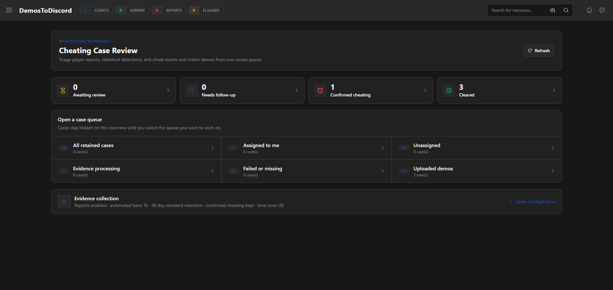
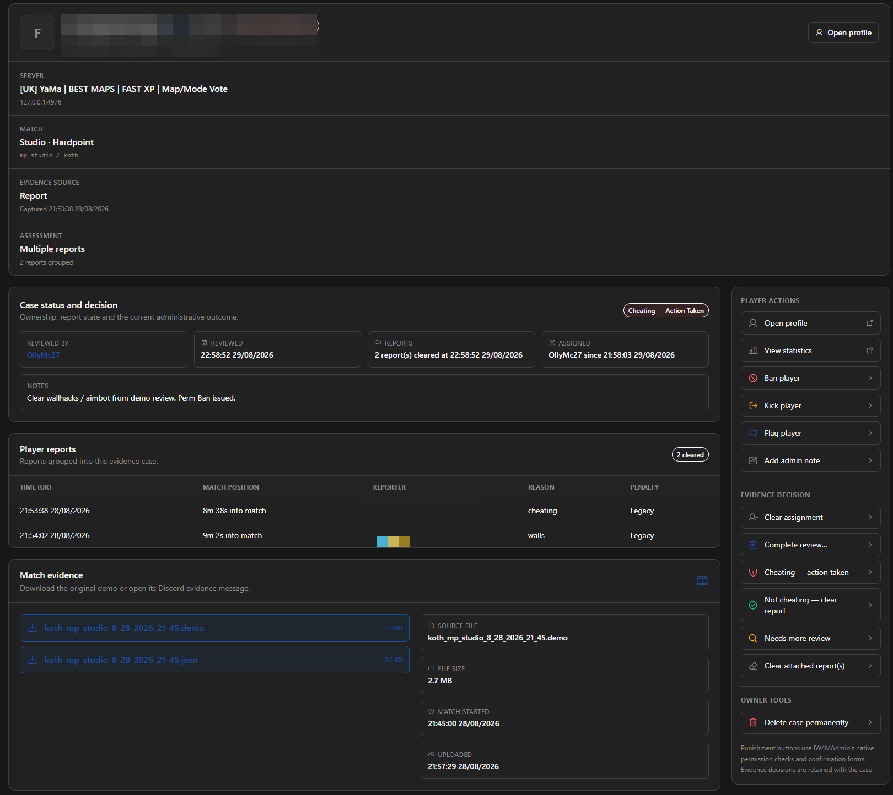
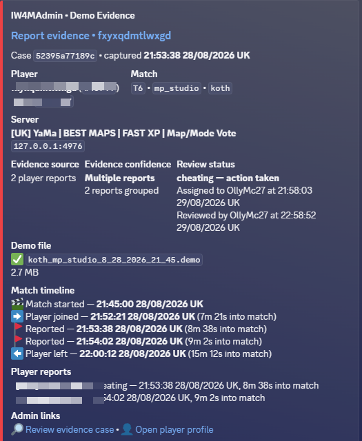

# DemosToDiscord    

### Turn player reports and unusual statistics into review-ready evidence for IW4MAdmin.

DemosToDiscord connects [IW4MAdmin](https://github.com/RaidMax/IW4M-Admin), Plutonium match recordings and Discord. It finds the relevant demo, groups reports and detections into one case, and gives moderators a focused review workflow inside the IW4MAdmin webfront.

With [ServerPulse](https://github.com/OllyMc27/ServerPulse) installed, moderators can inspect an unresolved cheating accusation with its nearby chat and match roster, identify the intended player, and create a normal evidence case. Community chat remains a human-review signal rather than proof. An inconclusive case can optionally flag the player in IW4MAdmin and alert Discord when they next join for live review.

[Download the latest release](https://github.com/OllyMc27/DemosToDiscord/releases/latest) · [Installation](https://github.com/OllyMc27/DemosToDiscord/wiki/Installation-and-Upgrades) · [Documentation](https://github.com/OllyMc27/DemosToDiscord/wiki)

## One place to review the whole case

- Match the correct T5 or T6 demo without renaming or compressing it.
- Group repeat reports, automated detections and match context into one retained case.
- See friendly map and mode names, report timing, player statistics and anti-cheat metrics.
- Assign cases, add notes and use IW4MAdmin's native moderation actions.
- Keep confirmed cheating cases permanently while applying configurable retention to routine cases.
- Deliver evidence to Discord and keep the original message in sync with the review outcome.

## Proactive review, with a human decision

Optional proactive detection compares completed sessions with server-aware baselines built from IW4MAdmin's existing statistics. Qualifying cases show a risk score and the specific unusual indicators that contributed. The plugin does not automatically ban, kick or punish the player—the evidence remains a moderator decision.

[Learn how proactive detection works](https://github.com/OllyMc27/DemosToDiscord/wiki/Proactive-Detection)

## Evidence delivered where staff already work

Discord messages include the original demo, T6 metadata when available, the match timeline and direct links to the case and player profile. Assignment and review changes update the same message rather than creating a trail of disconnected posts.

## Supported evidence

| Game/session | Review case | Demo delivery |
|---|---:|---:|
| T6 multiplayer | Yes | `.demo` + `.json` |
| T5 multiplayer | Yes | `.demo` |
| T5 Zombies | Yes | Metadata only |
| T4 | Yes | Metadata only |
| IW5 | Yes | Metadata only |

Metadata-only cases still retain the player, report, statistics, assignment, notes, actions and audit history when demo recording is unavailable.

## Quick start

1. Download `DemosToDiscord.dll` from the [latest release](https://github.com/OllyMc27/DemosToDiscord/releases/latest).
2. Copy it into `IW4MAdmin/Plugins`, replacing any older version.
3. Restart IW4MAdmin and edit `Configuration/DemosToDiscord.json`.
4. Follow the [installation guide](https://github.com/OllyMc27/DemosToDiscord/wiki/Installation-and-Upgrades) to add your webhook and demo folders.
5. Open **Admin → Cheating Case Review**.

## Documentation

- [Installation and upgrades](https://github.com/OllyMc27/DemosToDiscord/wiki/Installation-and-Upgrades)
- [Complete configuration reference](https://github.com/OllyMc27/DemosToDiscord/wiki/Configuration)
- [Cheating Case Review guide](https://github.com/OllyMc27/DemosToDiscord/wiki/Webfront-Guide)
- [Discord integration](https://github.com/OllyMc27/DemosToDiscord/wiki/Discord-Integration)
- [Admin commands](https://github.com/OllyMc27/DemosToDiscord/wiki/Admin-Commands)
- [Troubleshooting](https://github.com/OllyMc27/DemosToDiscord/wiki/Troubleshooting)
- [Privacy and retained data](https://github.com/OllyMc27/DemosToDiscord/wiki/Privacy-and-Data)

## License

[MIT](LICENSE)
