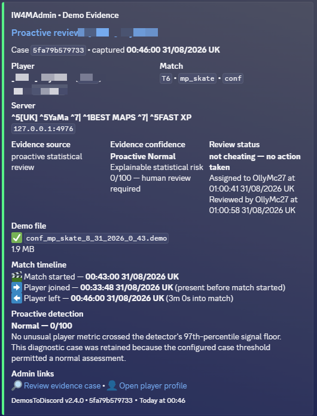
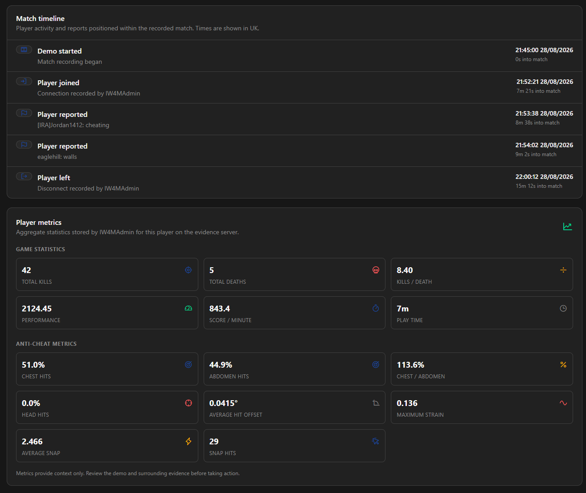

[](https://github.com/OllyMc27/DemosToDiscord/releases/latest)
[](https://github.com/OllyMc27/DemosToDiscord/actions)
[](LICENSE)
#DemosToDiscord
## Turn reports and unusual statistics into review-ready evidence

DemosToDiscord connects [IW4MAdmin](https://github.com/RaidMax/IW4M-Admin), Plutonium demos and Discord. It finds the right match recording, groups the surrounding evidence into one case and gives moderators a purpose-built review workflow inside the IW4MAdmin webfront. Version 2.4 also watches the statistics IW4MAdmin already records and can surface unusually strong player profiles for human review—without issuing automatic penalties.

[Download the latest release](https://github.com/OllyMc27/DemosToDiscord/releases/latest) · [Installation guide](https://github.com/OllyMc27/DemosToDiscord/wiki/Installation-and-Upgrades) · [Complete Wiki](https://github.com/OllyMc27/DemosToDiscord/wiki)


### One clean moderation workspace

- Open compact queues for awaiting review, follow-up, confirmed cheating, cleared cases, assignments and evidence state.
- Keep retained cases hidden until a moderator chooses the queue they want to work on.
- Reveal search and advanced filters only when needed, then filter by player, case, GUID, game, server, source, demo state, review state or date.
- See uploaded, missing and metadata-only evidence together.
- Share work through unassigned and assigned-to-me queues.
- Group repeat reports and detections from the same match into one case.

## Proactive, explainable review—not automatic punishment

DemosToDiscord builds conservative, server-aware baselines from the live IW4MAdmin statistics database. After a supported player session ends it can compare K/D, score per minute, performance, tracked-hit head rate and supported T6/IW5 aim-mechanics signals with comparable players.

- Every retained proactive case includes a risk score, level and the specific unusual indicators that contributed.
- Minimum population and sample requirements prevent decisions from thin data.
- Correlated metrics are grouped so the same behaviour is not counted repeatedly.
- Separate case and Discord thresholds keep low-value noise out of the queue and channel.
- No ban, kick, flag or report clearing is performed automatically; a moderator reviews the evidence and decides.

[Read how proactive detection works](https://github.com/OllyMc27/DemosToDiscord/wiki/Proactive-Detection)



## Everything needed to make a decision


Each case brings together the original demo, T6 JSON metadata, friendly and raw map/mode names, server context, reports, review notes and IW4MAdmin's native player actions. Moderators can assign work, ban, kick, flag, add notes, clear only the attached reports and record a final outcome without leaving the page. Owners also have a separately confirmed test/maintenance tool for permanently deleting a case.

## Jump straight to the useful moment



The match timeline shows when recording began, when the player joined, every report or anti-cheat event and when the player left—including the offset into the demo. Player statistics, anti-cheat metrics and proactive signal explanations sit alongside the timeline as context for the review.

## Discord evidence that stays in sync


- Uploads the original `.demo` directly—no ZIP archive and no renamed theatre file.
- Includes the T6 `.json` metadata sidecar when available.
- Links straight back to the evidence case and native player profile.
- Updates the original message when a case is assigned or reviewed while keeping its attachments.
- Sends high-risk proactive cases with their score and strongest explainable signals when enabled.
- Supports global, per-game and per-server webhooks with optional role mentions.

## No demo support does not mean a lost report

T4, IW5 and T5 Zombies reports remain fully actionable metadata-only cases. Administrators still get the report, player context, statistics, assignment, review controls and audit trail, with a clear explanation that recording is unsupported.

## What it captures

| Game/session | Evidence case | Demo delivery |
|---|---:|---:|
| T6 multiplayer | Yes | `.demo` + `.json` |
| T5 multiplayer | Yes | `.demo` |
| T5 Zombies | Yes | Metadata only |
| T4 | Yes | Metadata only |
| IW5 | Yes | Metadata only |

Configured T6 automated anti-cheat bans and proactive statistical reviews can create evidence even when nobody reports the player. Manual bans only attach to a recent matching case, preventing unrelated cross-server evidence.

## Install in minutes

1. Download `DemosToDiscord.dll` from the [latest release](https://github.com/OllyMc27/DemosToDiscord/releases/latest).
2. Copy it into `IW4MAdmin/Plugins`, replacing any older version.
3. Restart IW4MAdmin and edit `Configuration/DemosToDiscord.json`.
4. Set the Discord webhook and T5/T6 demo paths, then restart IW4MAdmin.
5. Open **Admin → Cheating Case Review**.

```json
{
  "Enabled": true,
  "Webhook": "https://discord.com/api/webhooks/...",
  "T5DemoPath": "C:\\Plutonium\\storage\\t5\\demos",
  "T6DemoPath": "C:\\Plutonium\\storage\\t6\\demos",
  "TimeZone": "Europe/London",
  "EnableProactiveDetection": true,
  "ProactiveCaseRiskThreshold": 50,
  "ProactiveDiscordRiskThreshold": 65
}
```

The [complete configuration reference](https://github.com/OllyMc27/DemosToDiscord/wiki/Configuration) covers queue timing, retention, privacy, timezones, capability overrides, Discord routing, server overrides and every supported setting. Set IW4MAdmin's `Webfront.ManualUrl` to its public address to include working case links in Discord.

## Built for shared administration

- Permission-protected webfront access and native IW4MAdmin confirmation forms.
- Configurable timezone plus per-server collection and Discord-routing overrides.
- Stable-file checks, background processing, deduplication and retry controls.
- Case history, previous player evidence, permanent confirmed-cheating records and case-scoped report clearing.
- In-game status, statistics, demo-search, webhook-test and retry commands.

See the [Admin Commands guide](https://github.com/OllyMc27/DemosToDiscord/wiki/Admin-Commands) for command names and permissions.

## Privacy

The plugin retains case metadata, review history and a rebuildable aggregate baseline cache—not demo contents or raw chat. Webhook secrets are never written to case/baseline state or displayed in the webfront. Review the [Privacy and Data guide](https://github.com/OllyMc27/DemosToDiscord/wiki/Privacy-and-Data) before publishing logs or screenshots.

## License

[MIT](LICENSE)
